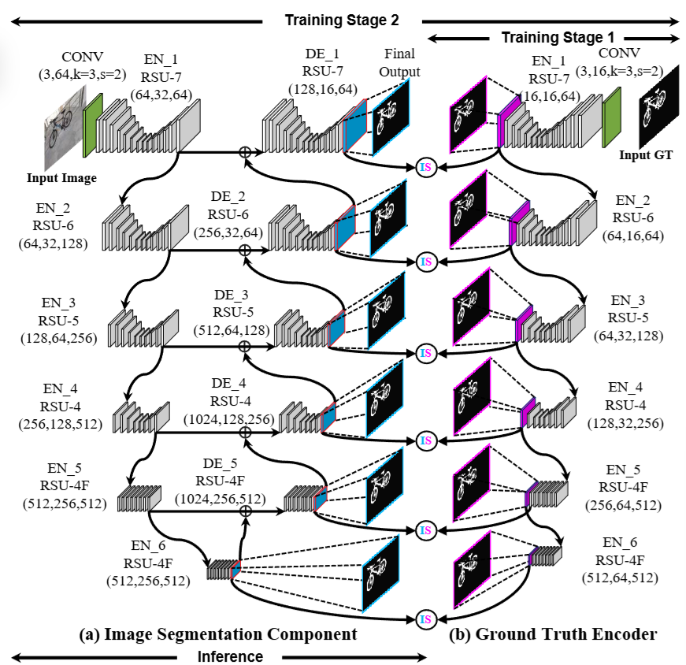

# ClearBG: Background Removal using U^2-Net

ClearBG is a deep learning project aimed at salient objects extraction and background removal from images using the U^2-Net architecture. This model provides pixel-level precision for tasks such as object segmentation, focusing on MLOps practices to ensure reproducibility, scalability, and seamless integration.

## Table of Contents

- [Overview](#overview)
- [Samples](#samples)
- [MLOps Workflow](#mlops-workflow)
- [Model Architecture](#model-architecture)
- [Datasets](#datasets)
- [Training](#training)
- [Evaluation](#evaluation)

## Overview

ClearBG leverages the U^2-Net model to extract salient objects from an image, removing the background with high precision. The project uses various datasets and MLOps tools like DVC for data versioning, MLflow for tracking experiments, and Docker for containerization. The entire training, evaluation, and pipeline processes are automated and can be easily reproduced using DVC pipelines.

## Samples

## MLOps Workflow

ClearBG follows a robust MLOps workflow with pipelines that include the following stages:

1. **Data Ingestion**: Downloads and extracts datasets, preparing them for training.
2. **Model Training**: Trains the U^2-Net model using hyperparameters like `epochs`, `batch_size`, and `learning_rate` as described in `params.yaml`
3. **Model Evaluation**: Evaluates the trained model using MLflow, ensuring proper experiment tracking and result logging.

The pipeline for each of these stages is managed using DVC and MLflow, ensuring reproducibility and version control.

## Model Architecture

The U^2-Net architecture is a deep nested U-Net model designed for high-quality salient object detection. The architecture is particularly useful for foreground object extraction, where the goal is to focus on the salient parts of the image while removing the background.

The architecture features a two-level nested modified U-Net-like structure, allowing for efficient training with minimal memory usage and computational overhead. Central to each level is the **R**e**S**idual **U**-block (**RSU**), which combines the advantages of residual blocks with a U-Net-like symmetric encoder-decoder framework.

- **Deep Nested U-Net**: Designed to capture multi-scale features, allowing the network to process both coarse and fine details in the image.
- **U^2-Net for Background Removal**: The U^2-Net model is fine-tuned for precise background removal, ensuring pixel-perfect segmentation for complex objects.

The U^2-Net paper uses **binary cross-entropy** as the loss function. Specifically, it calculates the loss for each of the six side output saliency maps and the final fusion output saliency map during training. The overall training loss is defined as a weighted sum of the individual losses for each map:

## Datasets

ClearBG uses two datasets for training and evaluation:  

1. **DUTS-TR**: A large-scale dataset for salient object detection, used for training.
It contains 10553 images. The dataset was further augmented by horizontal flipping to get 21106 images.
   
2. **DUTS-TE**: The testing portion of the DUTS dataset, used for model evaluation.

Both datasets are ingested via a custom pipeline that handles downloading, extracting, and preparing the data.

The model was further trained on [DIS5K Dataset](https://xuebinqin.github.io/dis/index.html#download) to segment highly accurate objects from images. 
[Learn more](https://arxiv.org/pdf/2203.03041#page=6.68)

## Training

In this implementation, fusion loss is calculated by combining side outputs along with the overall loss. This helps improve the model's accuracy by refining side predictions.

Several classes are used for preprocessing:
- RescaleT and Rescale: Rescale the images to a desired size.
- RandomCrop: Randomly crop the images to a specific size.
- ToTensor and ToTensorLab: Convert images and labels to tensors, normalizing the image data for model input.
- SalObjDataset: A custom dataset class for loading image-label pairs for training.

| Parameters                           | Values                                                                                           |
| ------------------------------- | ----------------------------------------------------------------------------------------------- |
| Input Preprocessing             | $(N\times N) \rightarrow (320\times 320) \rightarrow RandVertFlip \rightarrow (288 \times 288)$ |
| ConvLayer Weight Initialization | Xavier                                                                                          |
| $w_{side}^{(m)}$                | $1$                                                                                             |
| $w_{fuse}$                      | $1$                                                                                             |
| Learning Rate                   | $1e\!-\!3$                                                                                      |
| $\beta_1, \beta_2$              | $(0.9, 0.999)$                                                                                  |
| $\epsilon$                      | $1e\!-\!8$                                                                                      |
| weight_decay                    | $0$                                                                                             |
| Resizing                        | Bilinear Interpolation                                                                          |
#### Overall Loss
$L = \sum_{m=1}^{M} w_{side}^{(m)} \ell_{side}^{(m)} + w_{fuse} \ell_{fuse}$

#### Side Output Loss
$\ell_{side}^{(m)} = - \sum_{r,c} \left[ P_G(r,c) \log P_S^{(m)}(r,c) + (1 - P_G(r,c)) \log (1 - P_S^{(m)}(r,c)) \right]$

#### Fuse Output Loss
$\ell_{fuse} = - \sum_{r,c} \left[ P_G(r,c) \log P_S^{fuse}(r,c) + (1 - P_G(r,c)) \log (1 - P_S^{fuse}(r,c)) \right]$

## Evaluation

Using **MLflow** for experiment tracking and evaluation, the performance of the U2-Net model for salient object detection was assessed on the **DUTS-TE** dataset. The key evaluation metrics obtained are summarized in the table below:

| Metric                   | Score  |
|--------------------------|--------|
| Max F-measure (Fβ)      | 0.935  |
| Mean Absolute Error (MAE)| 0.027  |
| Weighted F-measure (Fwβ) | 0.895  |
| Structure Measure (Sm)   | 0.915  |

